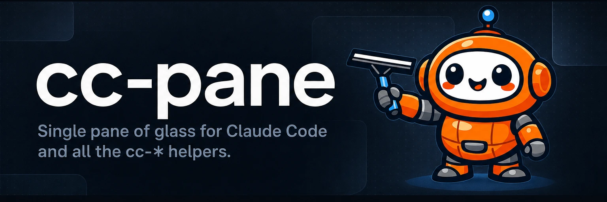

# 

**One of your Claude sessions is waiting on you right now.** cc-pane shows status, tasks, reviews, and token burn for every cmux, superset, and tmux session on one screen, so the stuck one can't hide.

[](https://github.com/yasyf/cc-pane/actions/workflows/ci.yml)
[](LICENSE)

## Get started

```bash
git clone https://github.com/yasyf/cc-pane && cd cc-pane && bun install
bun start
```

The full-screen dashboard opens (Ctrl+C exits):

```text
╭──────────────────────────────cc-pane───────────────────────────────╮
│No sessions yet. Backends (cmux, superset) land here.               │
│                                                                    │
│                                                                    │
│                                                                    │
╰────────────────────────────────────────────────────────────────────╯
```

Regenerate this frame anytime with `bash docs/scripts/demo.sh` — it captures a real `bun start` run in a tmux pane.

Driving with an agent? Paste this:

```text
Set up cc-pane: run `git clone https://github.com/yasyf/cc-pane && cd cc-pane && bun install`, then launch the dashboard with `bun start`.
Confirm the full-screen cc-pane frame renders and Ctrl+C exits cleanly.
Then read src/app.ts and report where the first backend (cmux) session list would plug in.
```

---

## Use cases

### Spot the blocked session without cycling five terminal tabs

Five Claude Code sessions means five terminal tabs, and the one stuck on a permission prompt looks exactly like the four that are working. Its interesting state — current task, pending review, token burn — lives in transcripts and sidecar cc-* tools, not in its scrollback. Put every session in one pane:

```bash
bun start
```

One frame, every session, status first. Today it renders the placeholder shown above; the cmux session list is milestone one.

### Swap cmux for superset or tmux without relearning your cockpit

cmux, superset, and plain tmux each manage sessions their own way, so changing orchestrators normally means rebuilding your monitoring habits from scratch. cc-pane treats them as interchangeable backends behind one UI: a backend plugs its session list into the renderable tree in `src/app.ts`, and the frame it renders into is asserted headlessly:

```bash
bun test
```

```text
 1 pass
 0 fail
 2 expect() calls
```

The suite captures the char frame through OpenTUI's test renderer, so any backend that renders the same session list passes the same assertions.

## How it's built

A bun + OpenTUI app: `src/index.ts` boots the CLI renderer and `src/app.ts` builds the renderable tree. Each cc-* helper (reviews, transcripts, pools) plugs its per-session meta into the pane instead of shipping its own front end — the pane is the shared cockpit they render into.

Status: early days — the dashboard renders the placeholder frame; backend orchestration (cmux first) is milestone one.

Licensed under [PolyForm Noncommercial 1.0.0](LICENSE).
